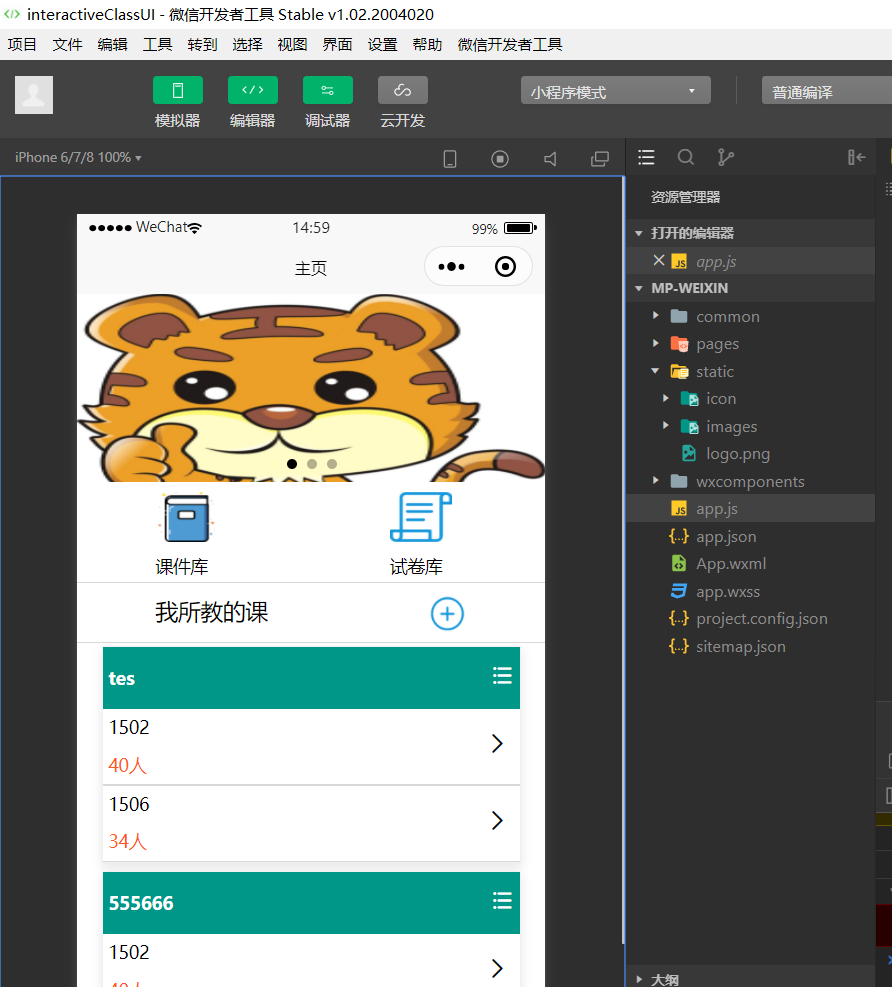
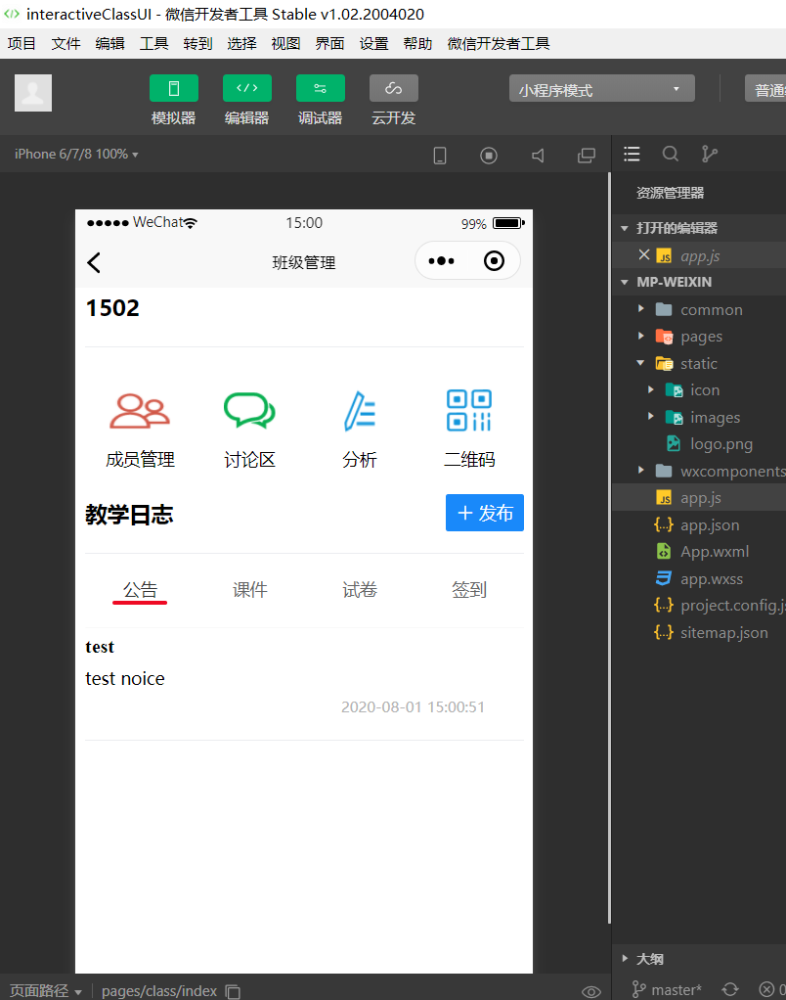
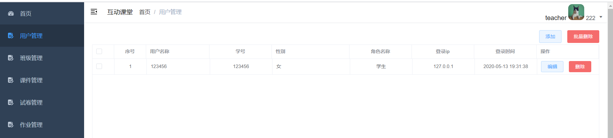
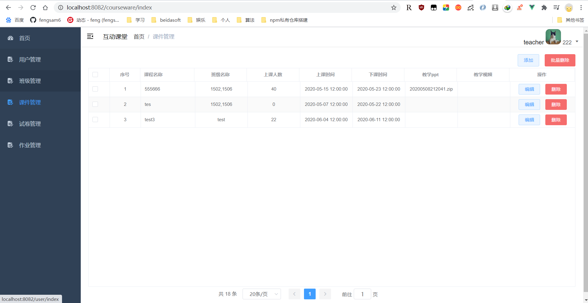
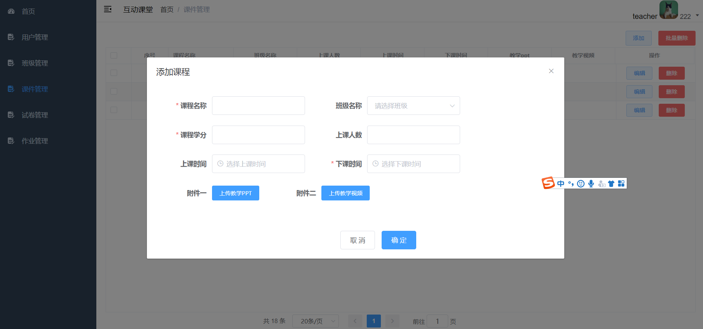
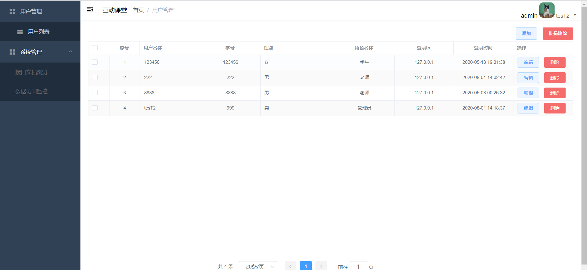

## 互动课堂系统简介

​      学生互动课堂系统，包含微信小程序、PC界面后台管理。采用前后端分离开发模式。模块interactiveClassUI，使用uni app、vue开发互动课堂微信小程序。模块interactiveClassAdminUi，基于vue  admin tempalate 二次开发后台管理系统。

### 一、模块简单说明

#### 1.模块interactive-class 简单说明

*  系统后端，为小程序、后台PC系统提供json接口。使用Spring boot、mybatis-plus、mybatis（数据库持久层框架）、shiro（系统权限控制）、MySQL等技术开发。
 *  项目启动。使用idea导入项目，下载maven依赖，运行ClassSystemApplication类main方法启动程序。

* 数据库使用mysql

* 前后端使用token验证户信息。

#### 2.模块interactiveClassAdminUi 简单说明

   * 互动课堂PC端后台代码(系统后台管理)，基于[vue  admin tempalate](https://panjiachen.gitee.io/vue-element-admin-site/zh/)开发，使用技术主要有vue、axios、vue router。

* 系统运行。第一次运行需要下载npm 依赖包，npm install（从网上下载npm 依赖包）。npm依赖下载完成后，执行启动命令：**npm run dev**，可以启动前端程序。

*注意在npm install安装依赖环境中可能会出现安装sass失败，原因是默认是从github下载存在外网限制，建议更换为国内淘宝镜像或者国内其它镜像下载*

#### 3.模块interactiveClassUI 简单说明

​      这个目录是小程序运行的代码，基于[uni-app](https://uniapp.dcloud.io/collocation/pages)开发，开发微信小程序。使用第三方UI库：[vant-weapp](https://youzan.github.io/vant-weapp/#/button)。搭建系统环境，与普通vue项目一样。  启动程序类似于上面的PC前端，第一步需要安装依赖环境：npm install , 第二步运行程序：**npm run dev:mp-weixin  **

### 二、系统功能

1.微信小程序。老师和学生可通过微信端注册用户。老师：新建班级->新建课程（添加现有的班级）->老师分享班级二维码可邀请学生加入班级。学生通过二维码加入班级，课堂讨论、做试卷。

2. PC后台系统。老师可以管理自己学生信息、管理班级信息、上传课件、查看作业。学生登录可以上传作业。

### 三、系统运行效果

#### 1、小程序运行效果

* 系统首页

* 班级管理

#### 2、PC后台台运行效果如下图片(学生、老师管、理员登录看的界面不同)

* 用户管理（老师只能看到自己学生）

* 课件列表、

  

  添加课件

  

* 用户列表（管理员可以查看所有用户）

### 四、系统运行说明

1. 安装系统运行基本软件。需要安装mysql、jdk(要求1.8)、maven、微信小程序开发者工具、npm、git(不是必须，建议安装)。

2、 下载代码。可以通过git命令：git clone https://gitee.com/ThreePeoplePlay/interactiveClass 下载代码。建议代码导入idea查看运行效果。

3. 配置maven依赖（建议使用阿里镜像）、下载系统 maven依赖。新建数据库interactive_class，导入sql脚本。(SQL脚本位置： 代码根路径\interactiveClass\interactive-class\sql\interactive_class.sql)。
4.  启动系统后端，运行模块class-system->com.code.classsystem.ClassSystemApplication main方法，观看系统后端是否启动。
5. 启动系统前端微信小程序。进入模块interactiveClassUI 根目录（该路径下面有package.json），第一次启动首先在根目录执行cmd命令：npm install，安装依赖。执行命令：npm run dev:mp-weixin,打包成微信小程序，使用微信小程序开发工具导入生成目录下interactiveClassUI/dist/dev/mp-weixin。在微信小程序查看运行效果（微信小程序系统启动请参考uni app）。
6. 启动系统后台PC界面。进入模块interactiveClassAdminUi  根目录（该路径下面有package.json），第一次启动首先在根目录执行cmd命令：npm install，安装依赖。执行命令：npm run dev，系统启动成功，可以在浏览器看到运行效果。（学生登录：123456/123456，老师登录：8888/8888，管理员登录：999/999，具体参看user表）